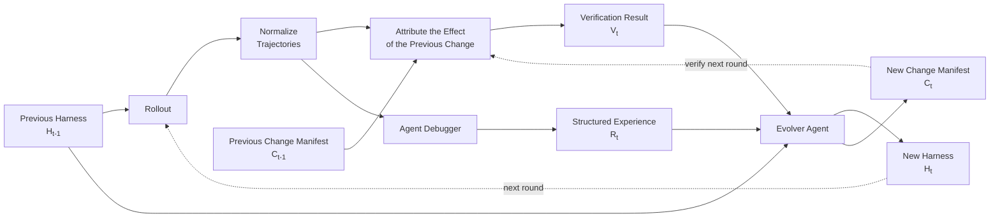

# Agentic Harness Engineering

> **Observability-Driven Automatic Evolution of Coding-Agent Harnesses**

## Overview

Agentic Harness Engineering starts from a simple claim:

> The main bottleneck in harness evolution is not the capability of the optimizer or the underlying model—it is **observability**.

A coding-agent harness is difficult to improve when its editable parts are unclear, its execution traces are too large to inspect, or the effects of previous changes cannot be verified. The framework addresses these problems through three complementary forms of observability and an iterative, evidence-driven evolution loop.

## Core Idea: Three Levels of Observability

### 1. Component Observability

The harness is represented as seven independently editable components:

$$
H = \{\text{prompt},\ \text{tool description},\ \text{tool implementation},\ \text{middleware},\ \text{skill},\ \text{subagent configuration},\ \text{long-term memory}\}.
$$

This decomposition makes the harness's action space explicit. Instead of treating the harness as one opaque object, the Evolver Agent can identify which component is responsible for a behavior and apply a localized change.

| Component | What the Evolver can inspect or modify |
| --- | --- |
| Prompt | Instructions, constraints, and reasoning guidance |
| Tool description | How tools and their intended use are presented to the agent |
| Tool implementation | The behavior and reliability of executable tools |
| Middleware | Logic that mediates model, tools, state, and execution |
| Skill | Reusable task-specific procedures and knowledge |
| Subagent configuration | Roles, delegation rules, and coordination settings |
| Long-term memory | Information retained and reused across runs |

### 2. Experience Observability

Raw agent trajectories can be enormous—on the order of **10 million tokens**. Reading every trace in full is expensive and makes systematic diagnosis difficult.

An **Agent Debugger** compresses these trajectories into structured overviews of roughly **10 thousand tokens**. The Evolver Agent reads the overview first, identifies the most informative failures, and only then decides whether a particular trajectory deserves deeper investigation.

This creates a coarse-to-fine debugging process:

1. Summarize the full rollout.
2. Surface important behaviors and failures.
3. Select only the cases that require detailed analysis.

### 3. Decision Observability

Every harness change is accompanied by a **Change Manifest** that acts as a falsifiable contract. The Evolver Agent must record:

- what it changed;
- why it made the change;
- which failures the change is expected to fix;
- which tasks should improve; and
- which tasks may regress.

The next rollout then tests these predictions. This turns harness evolution from an accumulation of plausible ideas into a sequence of auditable experiments.

At each round, the Evolver Agent should be able to answer four questions:

1. What is the current state of the harness?
2. Why did the agent fail in the latest rollout?
3. What was changed in the previous evolution round?
4. Did that change work as intended?

## Evolution Loop

### Step 1: Roll Out the Current Harness

$T_t = {Rollout}(M, H_{t-1}, D, K)$

where:

- $M$ is the underlying model;
- $H_{t-1}$ is the harness committed by the Evolver Agent in the previous round;
- $D$ is the benchmark task set;
- $K$ is the number of attempts made for each task; and
- $T_t$ is the resulting set of execution trajectories.

### Step 2: Normalize the Trajectories

The collected trajectories are converted into a consistent representation so that runs can be compared and analyzed across tasks, attempts, and evolution rounds.

### Step 3: Verify the Previous Modification

The system attributes behavioral changes between consecutive rollouts to the previous Change Manifest:

$V_t = {Attribute}(C_{t-1}, T_{t-1}, T_t).$

Here, $C_{t-1}$ describes the previous modification, its rationale, and its predicted positive and negative effects. The verification result $V_t$ captures what actually happened after the modification.

Based on this evidence, the Evolver Agent chooses one of three actions:

- **Keep** — retain the change because it behaved as predicted.
- **Improve** — refine the change because the direction was useful but incomplete.
- **Rollback + Pivot** — revert the change and pursue a different hypothesis.

### Step 4: Debug the Current Rollout

The Agent Debugger transforms the normalized trajectories into structured, compact experience:

$$
R_t = {AgentDebugger}(T_t).
$$

$R_t$ highlights the behaviors and failures that matter for the next evolution decision while preserving the option to inspect selected raw trajectories in depth.

### Step 5: Evolve the Harness

Finally, the Evolver Agent uses the previous harness, the structured debugging result, and the verification evidence to produce both the next harness and a new falsifiable contract:

$$
(H_t, C_t) = {Evolve}(H_{t-1}, R_t, V_t).
$$

The new Change Manifest $C_t$ is carried into the next round, where its predictions are evaluated against fresh rollout evidence.

## Why This Design Matters

The framework makes automatic harness evolution:

- **localizable**, because every change targets an explicit harness component;
- **scalable**, because large trajectories are compressed before detailed inspection;
- **testable**, because each modification includes predictions that the next rollout can falsify; and
- **recoverable**, because evidence supports keeping, improving, or rolling back a change.

The result is a closed-loop engineering process in which every modification has a target, every decision leaves a record, and every prediction is checked against observed behavior.
